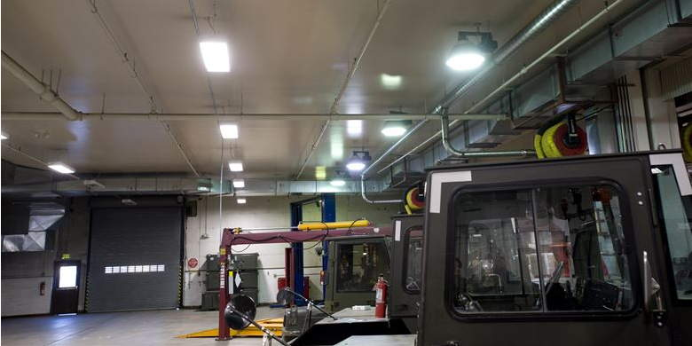
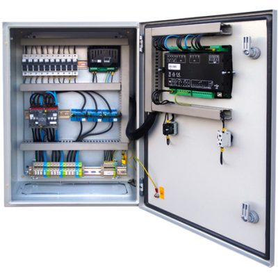

For this project I designed a custom device capable of controlling lighting and other electrical equipment over the Internet. This device can be used to control lighting at houses, offices, businesses, hotels, malls, convention centers and other public and private buildings. It can also control other electrical equipment such as heaters, pumps, machinery, etc.

This device features six 1,500W channels that can be switched on or off individually. Timers can be set for different channels, being able to operate autonomously even during connection drops, with support for different timezones and automatic summer/winter time change. It can be mounted on a DIN rail for installation inside standard electrical enclosures.

To protect this customer’s industrial property, the following image is just an example to illustrate the project and not a photo of the actual device.

Two models were built, one of them connects via WiFi featuring an Espressif ESP32 MCU, and the other one connected via Ethernet using a Microchip SAMD (ARM Cortex M0). The devices communicate via MQTT protocol with a Thingsboard server at the customer’s premises. The customer developed the user interface as an Android app that talks to the Thingsboard server through its REST API, allowing them to create alternative user interfaces such as a web app.

***

To protect this customer’s industrial property, images on this page are just examples to illustrate ideas and not actual photos of the devices.