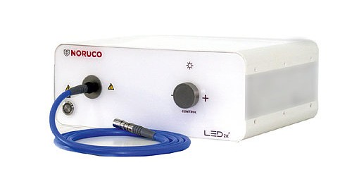

An endoscopy is a medical procedure that allows a surgeon to see and work inside the human body through very small openings. This device consists of an image sensor probe, a light source using a fiber optic cable, a CO2 pump to inflate the working area, a display that shows the video feed and a set of tools to perform the surgery.

I developed the firmware of a new series of LED cold light sources for endoscopies and a fiber optic cable tester for Noruco (Sevilla, Spain).

Watch a promotional video and see the device in action here: [https://www.youtube.com/watch?v=auT8LNaJRjU](https://www.youtube.com/watch?v=auT8LNaJRjU)

There are 4 different models of the light source. The Noruco LED 2K uses a touchscreen to control the intensity of light. It features a color LED ring for visual indications, as well as a cable sensor to turn off the source when there is no cable attached. It also has a standby mode and many other settings can be tuned using the touchscreen interface.

Noruco LED 2KA comes with a rotary encoder instead of a touchscreen. The LED ring shows the state of the light source.

Noruco LED 2K+ integrates a cable testing feature. Using high quality light sensors it is capable of providing very accurate assesments on the state of the fiber optic cables. The cable testing option can be accessed through the touchscren.

Noruco LED 2K2 packs two light sources in one that can be operated individually using the touch screen menu.

Noruco NC-10 is a cable tester and it does not have a light source. Following video shows how this device works: [https://www.youtube.com/watch?v=doaIuedfXXk](https://www.youtube.com/watch?v=doaIuedfXXk)

***

Information on this page, including multimedia elements, are property of Noruco S.L. and publicly available on [Noruco’s website](https://www.noruco.com/) and their [Youtube channel](https://www.youtube.com/channel/UCC8LwVXUlHSq01K_0sVkK5Q).