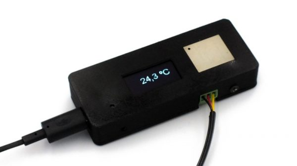
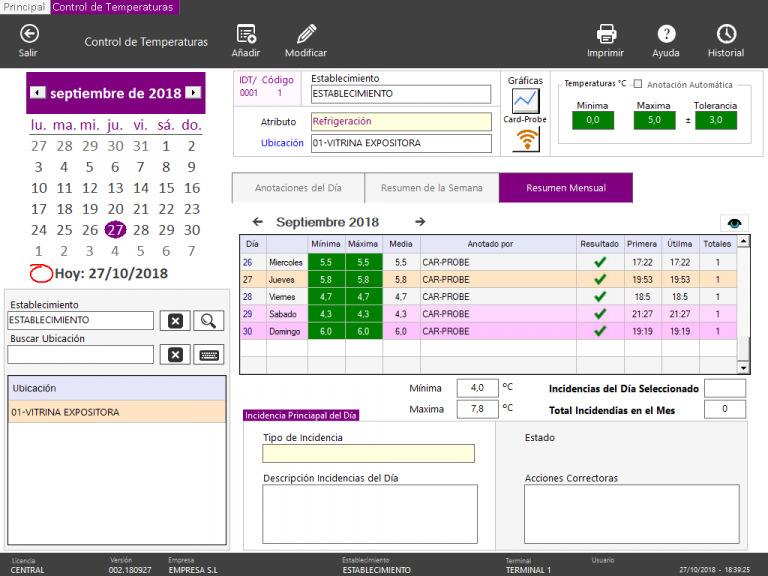
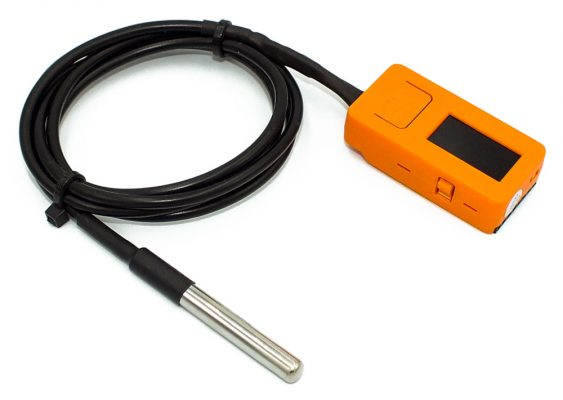

The regional government of Andalusia, Spain, has very strict regulations for monitoring the temperatures in refrigerators and refrigeration chambers in certain hospitality businesses. These regulations mandate daily logging of lowest and highest temperature reached in every refrigerator at restaurants and other businesses serving food.

Even though logging can be performed manually, this is a hassle for businesses owning a large number of refrigerators. To solve this problem I designed a wireless sensor probe for the company Plantecnic, in Spain. These probes connect via WiFi to the network and allow Plantecnic’s software to retrieve temperatures from all refrigerators in a given venue in real time, fully automating the task and providing alarms when temperatures go out of range.

To build these probes, I developed firmware running on an Espressif ESP32 and designed the case housing the electronics. These probes are integrated into Plan7 software by Pantecnic and they can use either dedicated WiFi infrastructure or the existing WiFi network at the final user’s premises.

Eventually, this probe was upgraded using an off-the-shelf M5StickC to scale manufacturability. Firmware had to be ported to the new device.

At the time of writing, there are tens of these probes deployed at different locations.

***

Information on this page, including multimedia content, is the property of Plantecnic and publicly available on [Plantecnic’s website](http://www.plantecnic.com/) and their marketing materials.